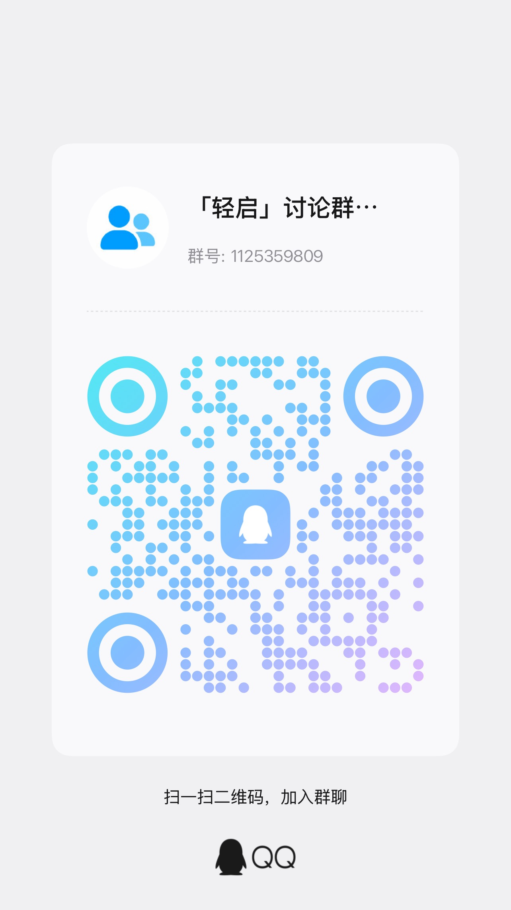

<h1 align="center">轻启</h1>

  
  
  
  
  

HarmonyOS 原生页面控件识别辅助工具。按提示对页面识别与学习，自动生成规则。

## 下载与安装

请从 [Releases](https://github.com/thx853068675-dev/quietstart/releases/latest) 下载：

- **首次安装**：选择对应平台的整合包。
- **已经安装整合助手**：可单独下载 HAP。
- **手机端更新**：已安装“小白·轻启”的用户，可在手机选择新 HAP 重签安装。
- 安装前请核对 Release 中提供的 SHA-256 校验值。

整合包中的调试助手基于 [likuai2010](https://github.com/likuai2010) 的「小白调试助手」修改并集成轻启 HAP，感谢原作者的开发与贡献。原项目与官方下载：[auto-installer](https://github.com/likuai2010/auto-installer)。轻启整合版由本项目维护。

HarmonyOS 应用的侧载签名与设备绑定；请使用整合助手为自己的设备完成签名和安装。

完整步骤见 [安装与升级说明](docs/INSTALL.md)。1.0.0 新增后台运行保护，需按提示授予后台定位权限。

## 交流群

欢迎加入「轻启」讨论群，交流使用体验、反馈问题。

[Telegram 交流群](https://t.me/+AEaSqM1kw4lmMmQ1)

**QQ群号：1125359809** · [点击加入 QQ 群](https://qm.qq.com/q/apWirjBLuo)

可点击上方链接申请加群，也可使用 QQ 扫描下方二维码，或搜索群号加入。

