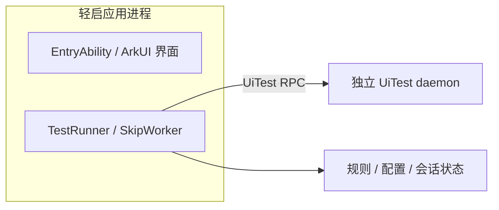

# 后台生存与恢复验证

## 0.9.52：本机监督与退出诊断

本机连接会在手机的已授权调试环境中启动独立监督任务。主界面和测试客户端仍共用应用进程；监督负责在执行链路异常时有限重建，不是系统级保活授权。

- 健康文件分别保存进程心跳、工作循环进展、成功 RPC、输入完成时间和当前操作。心跳定时器不刷新 RPC 或循环进展；界面也不再把这种假在线视为正常。
- 监督约每 5 秒检查一次；工作层超过 30 秒未响应并连续两次异常后恢复。首次启动留 45 秒宽限。每次本机连接最多恢复 3 次，间隔依次为 5、15、45 秒；耗尽后停止并提示重新连接。
- 灭屏时工作层先读系统电源状态，暂停窗口与广告扫描。已上报休眠且进程仍存在时，允许心跳被系统挂起，不因 RPC 不更新而重启。进程消失可有限重建，新工作层会重新检查电源；监督不主动唤醒屏幕。此策略仍需长时间灭屏实测。
- 关闭“自动跳过”只暂停输入；“结束本次连接”同时撤销监督和工作会话。新连接有独立令牌，旧实例不能恢复或覆盖新会话。系统明确返回最近任务结束或应用升级时停止自动恢复；同时处理厂商用 `NORMAL` 配合 `User Request` 消息表达主动清理的情况。
- 恢复复用已安装工作模块，不重新下载、安装模块，也不保持电脑或本机 HDC TCP 连接。监督本身被系统结束、无线调试撤权、重启等情况下仍可能需要用户重新连接。
- 异常恢复需先启动 EntryAbility 获取系统退出原因。读取后退回后台，测试客户端重建不再重复打开首页；初次手动连接仍打开首页。系统启动画面可能短暂出现，不能承诺零闪屏。这里使用[官方前台转后台接口](https://developer.huawei.com/consumer/cn/doc/doccenter-references/api/js-apis-inner-application-uiabilitycontext)，不是系统无界面启动授权。

设置 → 运行诊断 → 退出记录，可查看最近 20 条记录或主动复制完整 JSON。保存系统原始 `lastExitReason`、`lastExitMessage`、完整 `lastExitDetailInfo`（含系统额外字段）、启动原因/时间、系统/API/机型/主包与内嵌模块版本，以及退出前心跳、RPC、操作和错误码。系统可能返回空消息、零时间或 PID -1，原样保留，不据此猜测。这里的完整指 API 实际返回字段，并不保证系统提供崩溃栈或全部内存指标。

本机连接、模块安装、主动停止和工作会话重建另作标注，不修改系统原因。数据仅保留本机；公开诊断前应检查原始错误消息是否含个人信息。

2026-09-15，Pura X / HarmonyOS 7：

- 通过本机连接派生监督并自行更新内嵌模块；监督进程与应用/UiTest 分开，关闭激活 TCP 后仍持续检查。
- 强制结束应用后约 18 秒内采样到新应用/daemon 及新的有效 RPC，自动恢复次数为 1；电脑只注入退出、读取结果，没有执行恢复命令。
- 临时实验入口令当前工作循环的异步等待不返回，心跳保持更新。约第 37 秒记录 `rpc-stalled`，随后重建并恢复 RPC。这是可控等待故障，并非直接杀死 daemon。实验入口已从正式源码移除；补丁仅保存在忽略目录。
- 恢复后冷启动优酷，沿用已有规则，收到真实 UiTest 点击成功；该次输入调用 129 ms，不是通用性能保证。
- 界面“结束本次连接”后应用/daemon 和监督结束，继续观察 20 秒没有自行重启。
- 返回桌面、灭屏各 40 秒，同一组进程保留且恢复次数不增加；灭屏阶段 `sleeping`，RPC 停止更新而心跳继续。
- 同一实验会话中再连续结束进程，监督执行第 2、3 次恢复，电源状态仍为 `SLEEP`；再次退出后记录 `exhausted`，监督进程结束，没有第 4 次恢复。锁屏期间提示页未启动，解锁后重发同一提示 Want 已核验控制令牌停止。正式版补充普通打开时识别耗尽状态的本地兜底（边界单测通过），并在未连接概览直接显示提示；该兜底未再进行完整三轮灭屏注入。

最终包最近任务清理复测：本机返回 `NORMAL(2)`，同时给出 `User Request` 和原始 `killReason`。已保留原始字段，识别主动清理后撤销令牌，应用/daemon/监督均结束，30 秒观察内未重建工作会话。

拔线恢复已验证：手机预设脚本等待 90 秒，仅强制结束轻启一次；电脑在故障前已经断开，直到新工作进程与有效 RPC 出现之后仍未连接。手机日志记录约 20 秒恢复有效 RPC，随后用户确认“在线”。恢复由手机监督执行，预设故障脚本不包含启动命令。此项使用优化重复打开首页前的 0.9.52 包。

减少恢复界面打断后复测：只更新主包，再由本机连接自行更新内嵌工作模块。返回桌面后强制结束轻启，约 19 秒出现新工作进程与有效 RPC；监督恢复次数为 1。约 29 秒窗口采样中焦点保持桌面，工作层重建未重复拉起首页。此轮 USB 连接，仅注入退出和读取结果；采样不能排除极短的系统启动画面。退出原因记录仍有保存，后续冷启动优酷收到实际点击完成（该次输入调用 112 ms）。

### 长时间观察结果（2026-09-15）

北京时间 01:56:32 开始手机端两小时观察，每分钟只读采样进程、心跳、RPC 与监督状态，不主动注入故障或唤醒屏幕。开始时已使用 1 次恢复额度。07:03 收回日志后发现，应分为两段看待：

1. **原定两小时采样提前结束。** 实际得到 4 个健康样本，间隔为 60、60、61 秒；02:00:33 采样器记录 `stopped-by-control`，距开始 241 秒。系统退出记录在约 02:00:19 对原工作进程给出 `NORMAL(2)`、`User Request` 和相同原始 `killReason`；旧监督随后记录 `control-stopped` 并结束。这符合主动停止联动，不能当作两小时连续采样通过，也没有证据将此次退出归因为系统资源回收。
2. **后来建立的新会话存续约 5 小时。** 新会话于 02:01:04 启动，07:03:12 仍有对应应用、UiTest daemon、独立监督进程，以及新鲜心跳和有效 RPC；会话年龄约 5 小时 2 分钟，恢复次数为 0。监督日志记录 6 次 `waiting-resume → healthy`，均没有调用恢复。最长一段等待约 26 分 24 秒。该状态表示工作层此前上报休眠且 PID 仍存在，不是独立连续测得的锁屏时长。

这次支持长时间存续、休眠等待后继续响应和主动结束联动，但新会话没有完整的逐分钟采样序列；不能证明期间每一秒都健康。收回日志时未重新安装、激活、唤醒、注入故障或执行点击，只读取现有记录和进程。04:00 检查时 USB 未连接，07:03 用户重新连接后取得以上证据。没有测量真实耗电，也没有新增 OS 6、24 小时或零闪屏验证。HarmonyOS 6.1 仍不能宣称已解决其后台被杀原因。

## 0.9.51 历史基线

2026-09-14～15，Pura X / HarmonyOS 7，轻启 0.9.51。结论：**当前架构可在界面退到后台后继续工作，但主应用进程结束会同时失去测试客户端与对应的 UiTest daemon。独立监督任务重建会话的最小原型已在真机成立，尚未集成到正式版本。**

## 实际进程结构

正式包初始采样：应用 PID 33951，对应 daemon 命令为 `uitest start-daemon com.tonghongxiang.quietstart@33951@20020310@1`。实验包中，诊断代码从测试客户端读取的 PID 56621 与应用 PID 一致，daemon PID 为 56946。没有第三个独立的 ArkTS 工作进程。

因此需要区分三个动作：界面进入后台、移除最近任务、结束应用进程。本轮前者能够继续工作，后两者会终止执行链路。主界面无需一直显示，不等于主应用进程无需存活。

## 方法与范围

- 基线源码提交 `8246ba6`，系统参数报告 `OpenHarmony-7.0.0.105`，设备内 UiTest CLI 报告 `7.0.0.1`。
- 全程 USB 调试连接、手机充电。没有执行手机重启、真实内存耗尽、整机清理，也没有验证本原型在拔线后的表现。
- 临时实验包保持原有进程结构和工作循环，只增加显式启用的诊断入口。诊断由当前 `SkipWorker` 串行调用同一个 Driver，读取前台窗口，或点击轻启自己的 `quietstart-probe-skip`，再读取成功标记；没有用独立 CLI 点击冒充工作进程的点击能力。
- 后台 RPC 请求预先排定，在退出界面后执行，读取时不会重新打开轻启。点击验证需要打开自身测试页，因此只能证明该生命周期动作后能力仍可用，不能将点击发生时算作后台。
- 每约 2 秒采集应用/daemon PID、状态心跳、状态机和诊断结果。灭屏阶段不主动发起诊断 RPC，检查正常休眠和恢复观察即可。旧诊断结果不会当成新的成功。
- 实验包与工作模块通过 HDC 部署，故本轮不是首次侧载或模块自安装验证。最后恢复了保存的正式主包和工作模块，再经应用内本机连接恢复正常会话。没有发布实验版本。

## 12 项检查

| 编号 | 操作与观察时长 | 实测结果 |
| --- | --- | --- |
| L01 | 前台基线 | 工作进程读取窗口、点击自身按钮并确认成功；一次探针约 153 ms。不是开屏跳过耗时。 |
| L02 | Home 返回桌面约 45 秒 | 同一应用与 daemon PID 保留；后台 RPC 读取桌面成功；返回后测试点击成功。 |
| L03 | 系统设置在前台约 45 秒 | 同一组 PID 保留；后台 RPC 读取设置窗口成功；返回后测试点击成功。 |
| L04 | 连续返回退出测试页及轻启界面，约 20 秒 | 返回先前的设置页面，心跳、RPC 与之后的测试点击正常；不据此声称应用进程已退出。 |
| L05 | 向轻启 PID 发送 Critical 内存通知，约 15 秒 | 官方命令返回成功，之后心跳与点击正常。此项不是 OOM 或真实低内存回收。 |
| L06 | 灭屏约 45 秒、唤醒后观察约 5 秒 | 心跳持续，状态为 sleeping；亮屏后恢复 waiting。此阶段没有执行新的专用点击探针。 |
| L07 | 计划暂停/恢复应用进程 | 权限预检 `kill -0` 返回 Operation not permitted；没有实际注入 SIGSTOP，不能判定暂停恢复能力。 |
| L08 | 计划单独终止 UiTest daemon | 权限预检返回 Permission denied；没有实际终止 daemon，独立 daemon 故障自愈未验证。 |
| L09 | 官方 `aa force-stop` 停止轻启，观察约 20 秒 | 应用和 daemon 均消失，心跳停止；没有自行重启。 |
| L10 | L09 后普通打开轻启，观察约 20 秒 | 仅出现新的界面进程，没有 daemon；心跳继续过期，界面显示未连接。普通打开不会重建会话。 |
| L11 | 显式重新启动测试会话 | 由调试端重新发起 `aa test` 后出现新进程，诊断点击成功。这是人工恢复，不是自动自愈。 |
| L12 | 最近任务中上划移除轻启卡片，观察约 20 秒 | 轻启卡片消失，随后应用和 daemon 均结束，心跳停止，没有自行恢复。只移除轻启，没有清理其他任务。 |

L02～L06 已采样的心跳最大年龄不足 2 秒。进程被杀后，磁盘仍可能保留 `running: true`；当前界面还会检查心跳是否在 6 秒内，所以最终能正确显示未连接。不能只看 `running` 或磁盘文件存在。

这是一套边界检查，有失败结果，也有两项未能注入故障，不能表述为“12 项全部通过”。尚未验证几小时、几天的持续稳定性或真实耗电。

## 额外最小原型：独立监督任务

另做 P01：在手机上通过 `nohup`、`setsid` 启动独立 shell 任务，最长等待 30 秒，仅检查轻启进程是否消失，最多调用一次 `aa test`，随后退出。原型由 HDC 投递和启动，没有依赖电脑循环执行重启命令，但本轮 USB 始终连接。

实测顺序：

1. 原会话 PID 11749，诊断点击成功。
2. 监督任务开始后，通过官方命令停止轻启。
3. 监督任务发现进程消失，自动调用 `aa test`。日志显示发现退出与启动命令返回相隔约 3 秒；这不是点击恢复耗时。
4. 新应用 PID 13534、daemon PID 13641，出现新的会话心跳；新进程随后点击自身测试按钮并确认成功。
5. 监督任务记录 finished 后退出。没有留下循环重启任务。

它证明了**独立于应用进程的监督任务可以重建这条执行链路**。它没有证明 daemon 单独失联、RPC 挂死、端口变化、无线调试关闭、拔 USB、系统冻结监督任务或重启后仍能恢复，也没有验证手机自行启动这段监督原型的完整流程。

## 推荐的后续实现

1. **先拆分健康状态。** 保留进程心跳，并记录最近一次 RPC 成功、主循环进展、输入完成时间，以及正在等待的操作。当前 2 秒心跳不等价于执行链路健康；RPC 挂起是否仍能更新心跳尚需另行注入验证。灭屏时允许休眠，不能因没有扫描而误触发重启。
2. **再把监督任务接入本机激活。** 已有 `LocalActivation` 可以派生独立任务，当前任务执行完启动命令便结束。可沿用该启动入口做单实例监督，优先重建测试会话，无需重新安装工作模块。P01 的成功支持继续做这个方向，但接入、拔线和长时间验证仍未完成。
3. **明确退出和重试边界。** 用户在应用内结束会话时同时结束监督；防止多个工作实例、安装循环和无限重启。设置有限重试、递增间隔与冷却期；持续失败后停止并提示重新激活。还需研究如何区分系统回收与用户主动停止，不能把所有退出都当作故障。
4. **最后验证持续运行和成本。** 分别做断开 USB、亮屏切换、长时间灭屏、真实内存压力、关闭/重新开启无线调试及重启测试。长时间验证至少记录 2 小时与 24 小时的会话健康、重建次数和能耗，避免用短时实验外推多天稳定性。

不建议为了名义保活虚构音频、定位等后台任务。官方后台任务需要符合具体场景；普通应用退到后台受到挂起和终止管理。[华为后台任务使用说明](https://developer.huawei.com/consumer/cn/doc/doccenter-app-quality/bpta-use-of-background-tasks)

`keepAlive`、`allowCommonEvent`、`runningResourcesApply` 属于设备厂商配置的应用特权，需要产品配置及签名匹配。它们不能通过普通侧载包自行声明就获得；只有掌握系统镜像和相应授权时，才值得研究所谓 Level 3。[OpenHarmony 应用特权配置指南](https://github.com/openharmony/docs/blob/master/zh-cn/device-dev/subsystems/subsys-app-privilege-config-guide.md)

## HarmonyOS 6 兼容性与后台被杀反馈

2026-09-15 补查。反馈为 **HarmonyOS 6.1 / 轻启 0.9.43，应用后台被杀**。尚未取得反馈设备的完整系统构建号、API 级别、进程与退出日志；以下区分源码事实与待验证原因，不把“未连接”替代用户报告的进程终止，也不据此断言 OS 6 比 OS 7 管控更严。

### 安装要求与实际支持范围

已核对 `v0.9.43` 标签源码、归档的 0.9.43 主 HAP/内置工作模块及 Mac 整合 ZIP 中的轻启 HAP，同时核对当前 0.9.51 主包：最低 API 元数据为 `60101024`，目标为 `260000026`，与构建配置的 `compatibleSdkVersion: 6.1.1(24)`、`targetSdkVersion: 26.0.0` 一致。它们面向 API 26 构建，最低要求 API 24；不能概括为支持所有 OS 6。“6.1”简写也不足以确定实际 API 级别，需读取设备值。[官方开发套件版本列表](https://developer.huawei.com/consumer/cn/doc/doccenter-release-notes/apidiff)

0.9.43 的公开发布验证范围也是 Pura X / HarmonyOS 7；本轮没有新增 OS 6 真机验证。[历史发布记录](https://github.com/thx853068675-dev/quietstart/releases/tag/v0.9.43)

0.9.43 与 0.9.51 均有 `sdkApiVersion < 26` 的旧识别通路，但不等价于新版能力：

| 项目 | API 24/25 通路 | API 26 通路 |
| --- | --- | --- |
| 识别 | 多次查询文字、描述、ID 和父容器；目标仍要求可点击 | 整体控件树、结构识别及有预算的 OCR 兜底 |
| 非聚焦开屏窗口 | 只查 focused / active | 另有完整布局的可见窗口回退 |
| 未见广告自动暂停 | 不累积有效检查，`cleanEligible` 被版本条件关闭 | 支持完整检查与暂停判定 |
| 强化学习（0.9.51 新增） | 缺少等价布局读取实现 | 事件与前后快照对应确认 |

官方本机 SDK `@ohos.UiTest.d.ts` 将 `Driver.dumpLayout()` 标注为 `@since 26.0.0`，而点击事件监听为 API 22。当前 `ManualLearningWorker` 捕获布局读取异常后报告学习失败，但未提供旧系统替代实现；0.9.43 尚无该功能，因此它不能解释本次 0.9.43 后台被杀。桌面名称读取也调用新接口，但异常被局部捕获，不会因此直接结束工作循环。SDK 中沉浸材质 `IMMERSIVE`、`ADAPTIVE` 标注为 6.1.0(23)，没有证据把后台被杀归因于导航栏材质。

### 与后台终止直接相关的线索

1. **执行层仍依附应用进程。** 0.9.43 的 TestRunner 启动同一包内 EntryAbility 并运行 SkipWorker；本轮 0.9.51 已实测界面与客户端共用应用进程。两个版本的本机启动命令均为独立 shell 发起一次 `aa test` 后结束，没有常驻监督。主进程被回收就会失去执行链路，正式版本没有自动重建。这解释了被杀后的后果，尚不能解释反馈设备最初为什么被杀。
2. **资源消耗有需要量化的位置。** 0.9.43 待命循环每轮结束后等待 500 ms，再重新查前台；观察前 3 秒轮间等待 60 ms，低版本候选查询可能继续遍历父容器。设置使用同步读取和 JSON 解析，状态每 2 秒连同最多 200 条历史一起重写，灭屏仍保留心跳。实际周期还包含查询耗时，不能把 60 ms 写成固定每秒 16 次扫描。这些是 CPU、IPC 和 I/O 测量点，尚无 OS 6 数据证明它们触发系统阈值。
3. **测试异常会走结束路径。** 两版都只容忍 `17000004` 控件/窗口失效，其他未局部处理的 UiTest 异常会结束循环并调用 `finishTest`；循环后的 `driver.delayMs()` 抛错也进入外层结束路径。排查应保留终止前错误码和操作，以判断它是否先于进程退出发生，不据此否认用户观察到的被杀。
4. **退出原因没有被保存。** 两版 `EntryAbility.onCreate` 都接收 `launchParam`，但没有记录 `lastExitReason`、`lastExitMessage` 或 `lastExitDetailInfo`。现有心跳只能说明过去是否活跃，不能回答为什么终止。

官方明确后台应用存在挂起、终止与资源管理；Test HAP 或 debug 签名不是文档承诺的长期存活资格。[后台任务合理使用](https://developer.huawei.com/consumer/cn/doc/doccenter-app-quality/bpta-use-of-background-tasks) 当前未找到可将本次反馈直接归因于 OS 6.1 特有 UiTest 缺陷的官方证据。

### 最小定位与修复顺序

先给 OS 6 反馈用户提供保存退出信息的诊断版本：在 `onCreate` 最先保存系统版本、API、应用/工作模块版本、上次退出原因/时间/内存，以及退出前会话摘要；本机激活本身的 `force-stop` 和用户主动停止要单独标记，避免误报。信息只在本地保留有限条目，由用户主动导出，不增加云上报或高频采样。

| 系统结果 | 下一步 |
| --- | --- |
| `RESOURCE_CONTROL` / `PERFORMANCE_CONTROL` | 按具体消息检查 CPU、I/O、内存压力或温控，再针对对应负载优化 |
| `APP_FREEZE` | 对齐 FaultLog 时间、前后台状态及阻塞栈，排查挂起的 RPC 或事件循环 |
| `JS_ERROR` / `CPP_CRASH` | 对齐堆栈与最后一次接口调用，修兼容性或崩溃 |
| `USER_REQUEST` | 对应最近任务结束；不要当系统异常无限拉起 |
| `NORMAL` / `UNKNOWN` / `SIGNAL` | 结合会话结束记录和系统日志，不仅凭枚举推断用户操作或资源回收 |

这些退出信息在 API 24 已有：原因自 API 9/10、详细消息自 API 12、退出时间/PID/RSS 等详细信息自 API 18 提供。`NORMAL` 也可能由直接退出或内核 kill 产生，并非一定是用户主动退出。[官方退出原因定义](https://github.com/openharmony/docs/blob/master/zh-cn/application-dev/reference/apis-ability-kit/js-apis-app-ability-abilityConstant.md#lastexitreason)

AppFreeze 可通过系统 FaultLog 或 HiAppEvent 收集；它是无响应故障，不等同于正常后台挂起。[官方排查方法](https://developer.huawei.com/consumer/cn/doc/doccenter-app-quality/bpta-stability-app-freeze-way)

有原因证据后，再做 OS 6 能力适配、减少重复 I/O 和有限会话自愈，并在 OS 6 / OS 7 分别验证普通后台、灭屏、任务清理、拔线及长时间运行。**当前 0.9.51 没有完成后台自愈集成，不能承诺升级就解决 0.9.43 的被杀反馈。** 本节仅为代码/归档包/官方资料调查，诊断采集和上述改造尚未实施。

## 实验材料

本机忽略目录 `dist/lifecycle-0.9.51/` 保存采样 JSONL、权限预检结果、临时诊断补丁、单次监督脚本/日志及原始正式包备份，不随源码公开。系统最近任务截图包含其他应用，只保留在本机。

正式业务源码与正式包均已恢复，监督实验任务已结束。规则、审批及设置按实验部署前的实际快照逐项比较；不恢复更早版本的历史规则，以免撤销用户此前的调整。
