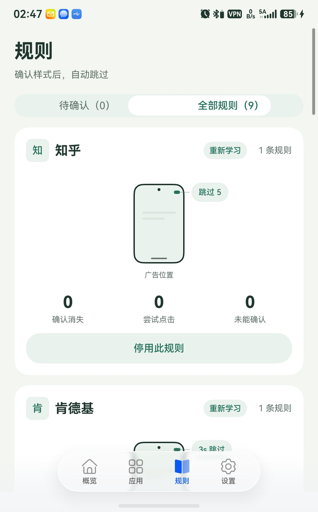
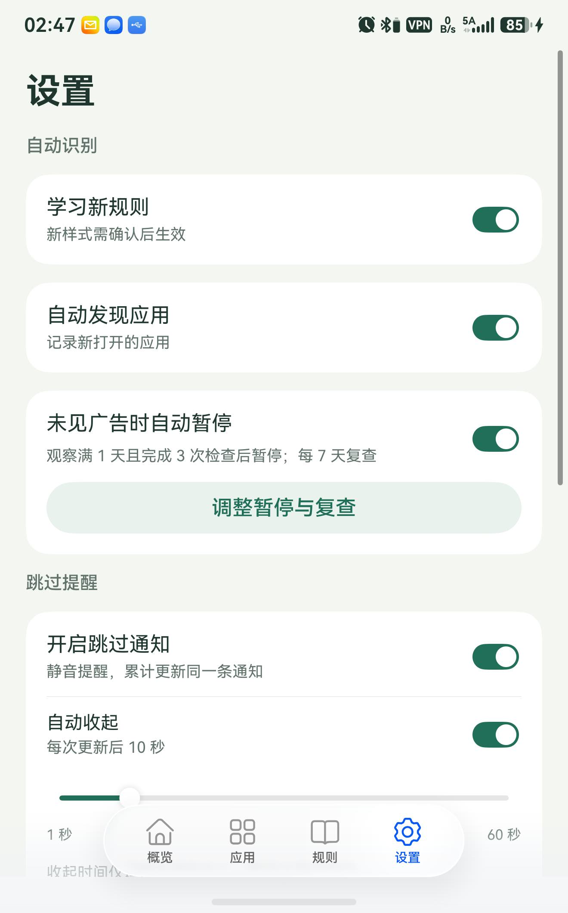

# 使用说明

先完成 [侧载安装](INSTALL.md)，再按下面的顺序开始使用。**只侧载轻启主包，UiTest 工作模块由轻启在首次本机连接时自动安装。**

截图来自 Pura X / HarmonyOS 7 上的轻启 **0.9.42**，于 2026-09-13 通过官方 hdc 与系统截图工具采集。图中的应用、数量和端口是拍摄时的状态，以自己手机显示为准；点击图片可查看大图。

## 1. 连接本机，确认在线

首次使用按向导操作；以后从“概览 → 本机连接”进入。已在线时，可点击右上角“在线”，再展开“查看重新连接步骤”。

1. 按页面入口开启开发者模式；若系统要求重启，重启后回到轻启。
2. 开启无线调试，记下系统当前显示的端口。
3. 在轻启填写端口，点击“连接轻启”，并允许系统调试授权。
4. 等待自动准备工作模块、应用重新打开，确认概览显示“在线”。

图中已经连接，因此按钮显示“已连接”；不要照抄示例端口。重启、端口改变或会话结束后，按上述步骤重新连接即可，无需删除规则或手动导入 UiTest。

“自动跳过”是总开关。暂时不想跳过时可关闭它；“会话详情”中可结束本次连接。激活成功后无需电脑持续连接。

## 2. 发现广告并启用规则

1. 在“设置”中保持“学习新规则”和“自动发现应用”开启。
2. 正常打开其他应用，触发一次开屏广告。
3. 返回“规则 → 待确认”，检查按钮文字、样式与广告位置，确认后启用。
4. 确认该应用及自动跳过总开关已开启，再次遇到匹配样式时查看跳过结果。

图中是“全部规则”下的**已启用规则**，所以按钮显示“停用此规则”。“待确认”为 0 只表示当前没有等待确认的新样式，不代表学习功能关闭。

- 同一应用只占一个卡片；有多条规则时可左右滑动切换，通过圆点查看位置。
- 手机轮廓中的标记表示广告按钮位置，外侧文字显示识别到的按钮样式。
- 已有规则不会阻止学习新样式；新样式仍需单独确认。
- **“重新学习”会删除该应用原有规则及审批状态。** 仅临时关闭时用“停用此规则”。

## 3. 按应用管理检测

底部进入“应用”，上方滑块切换分区；搜索框只搜索当前分区，找不到时先切换分区。

| 分区 | 含义 |
| --- | --- |
| 自动跳过 | 已有启用规则，可自动跳过的应用 |
| 待观察 | 已发现、仍需观察和确认规则的应用 |
| 已暂停 | 手动暂停，或多次未见广告后自动暂停的应用 |

点击“管理”可查看该应用并调整检测状态。“待观察”卡片显示有效检查次数及还需满足的时间条件。带“卓”标记的应用来自卓易通；系统无法提供显示名时，可手动备注。

## 4. 用运行记录排查问题

进入“概览 → 运行记录”，每个运行过程占一张卡片。点击右侧**眼睛图标**展开时间线，查看具体原因和用时，再次点击可收起。

图中记录说明“此应用已暂停”，因此没有学习或点击。遇到相同情况，可去“应用 → 已暂停 → 管理”恢复检测。

| 信息 | 怎么看 |
| --- | --- |
| 确认消失 | 连续两次未再看到目标控件，不单独证明是点击导致广告关闭 |
| 尝试点击 | 已执行点击尝试，不等于广告一定关闭 |
| 未能确认 | 未取得足够的关闭证据，不等于必然失败 |
| `+… 秒` | 相对这次运行过程的时间；下面同时显示具体时刻 |
| 本轮检查用时 | 本次检查耗时，与“发现前台后经过多久”分别显示 |

## 5. 调整学习、暂停和通知

进入“设置”，上方是自动识别和跳过提醒。

**未见广告时自动暂停**：点击“调整暂停与复查”，可设置观察跨度、完整检查次数和复查间隔。默认是观察满 1 天、完成 3 次检查、每 7 天复查。

正常情况下稳定观察约 6 秒，信息不稳时最多 12 秒；有效检查之间需间隔 30 分钟。达到时间和次数门槛后，仍需有效检查确认，不会只因时间流逝自动暂停。自动暂停后可手动恢复，并不表示该应用永远没有广告。

**跳过通知**：开启后累计更新同一条静音通知。可选择 1～60 秒后自动收起，或关闭“自动收起”后手动清除。收起时间控制通知中心里的通知，横幅展示由系统控制。用“预览通知”检查效果，“通知设置”可进入系统设置。

## 6. 识别条件和主题

在设置页继续向下滑动。

“查看与编辑条件”用于管理本机文字识别条件，无需订阅地址或云端更新。它影响新样式的识别，与“规则”页已经确认的应用规则不是同一项；不确定时可先保留内置条件。

主题支持“白色”“黑色”和“跟随系统”。选择“跟随系统”后，应用随系统明暗模式切换。

## 常见问题

| 问题 | 先检查什么 |
| --- | --- |
| 连接失败 | 完整主包、无线调试、当前端口及系统授权；详细排错见 [侧载指南](INSTALL.md#遇到问题) |
| 升级后离线 | 在轻启中重新本机连接，不必删除规则 |
| 在线但不点击 | 规则是否启用、应用是否暂停、总开关是否开启，再看时间线原因 |
| 没有学到规则 | 学习和自动发现是否开启；缺少控件信息或广告依据时会拒绝学习 |
| 应用只显示包名 | 系统或卓易通可能未提供名称，可手动备注 |
| 通知没有横幅 | 检查系统通知权限及横幅设置，先使用“预览通知”测试 |
