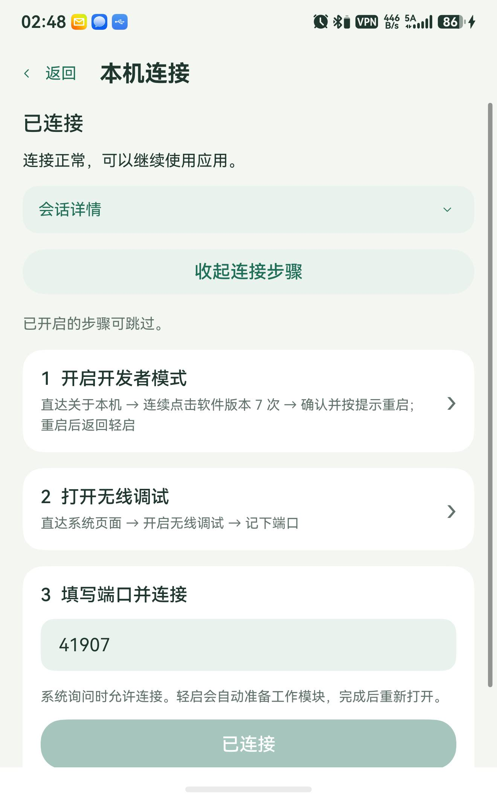
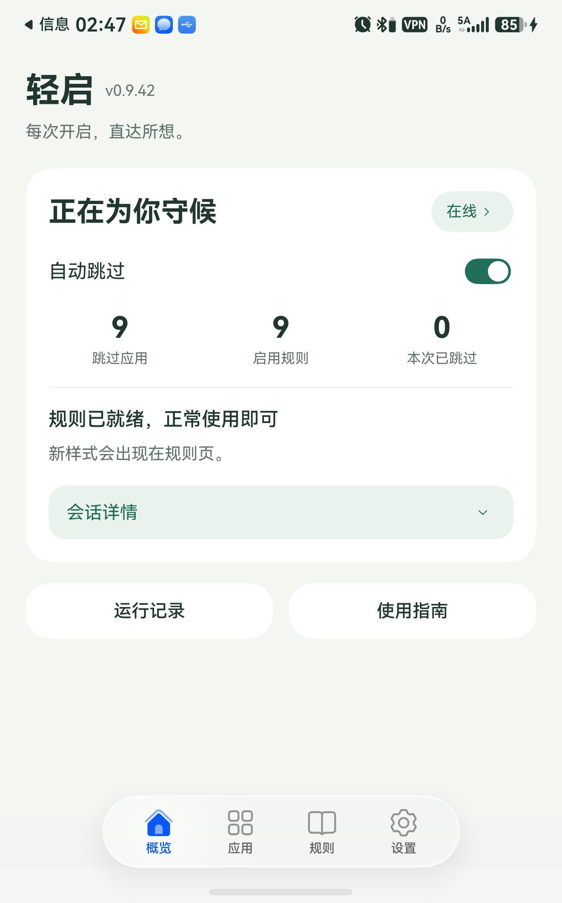
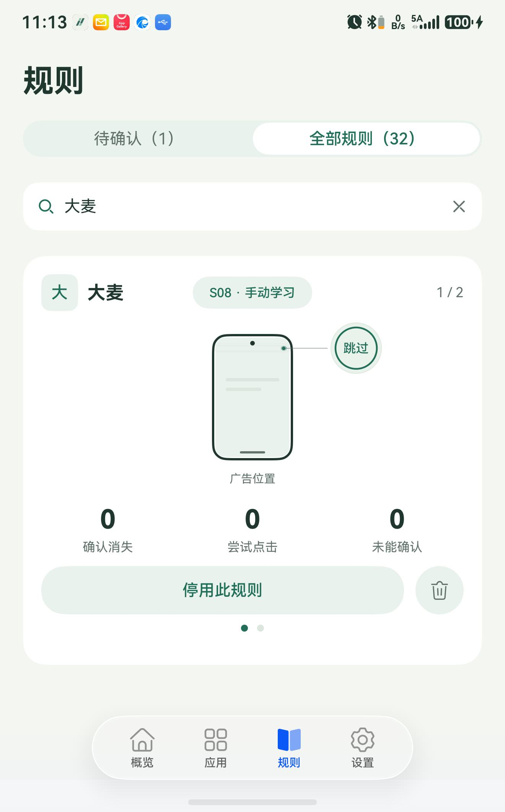
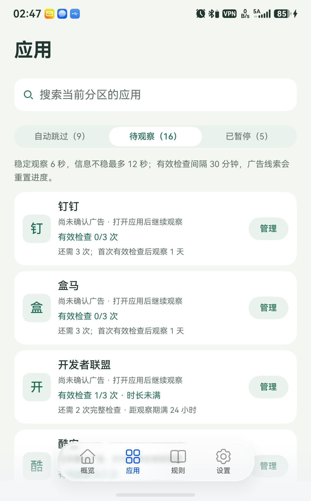
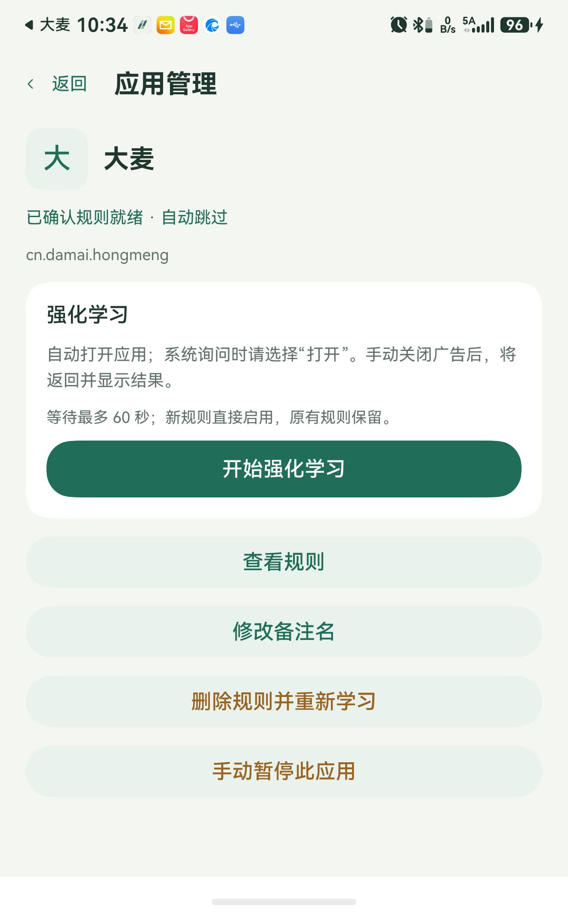
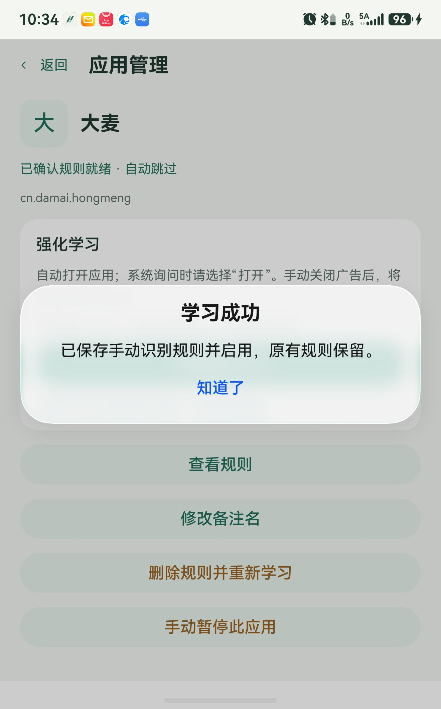
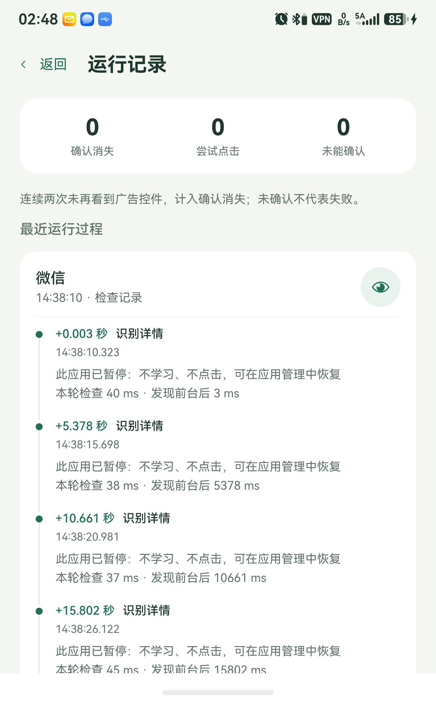
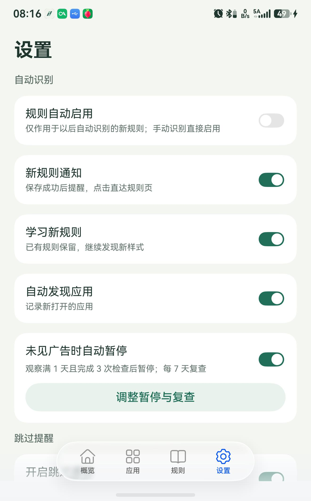
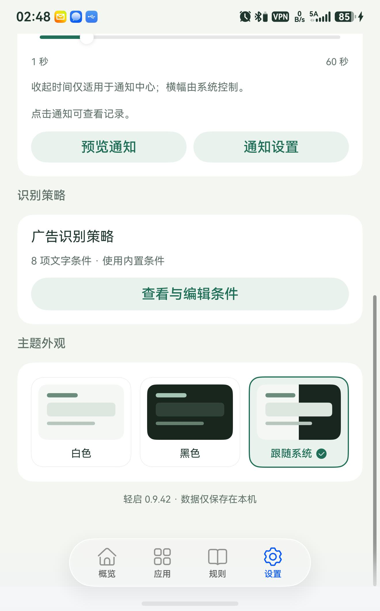
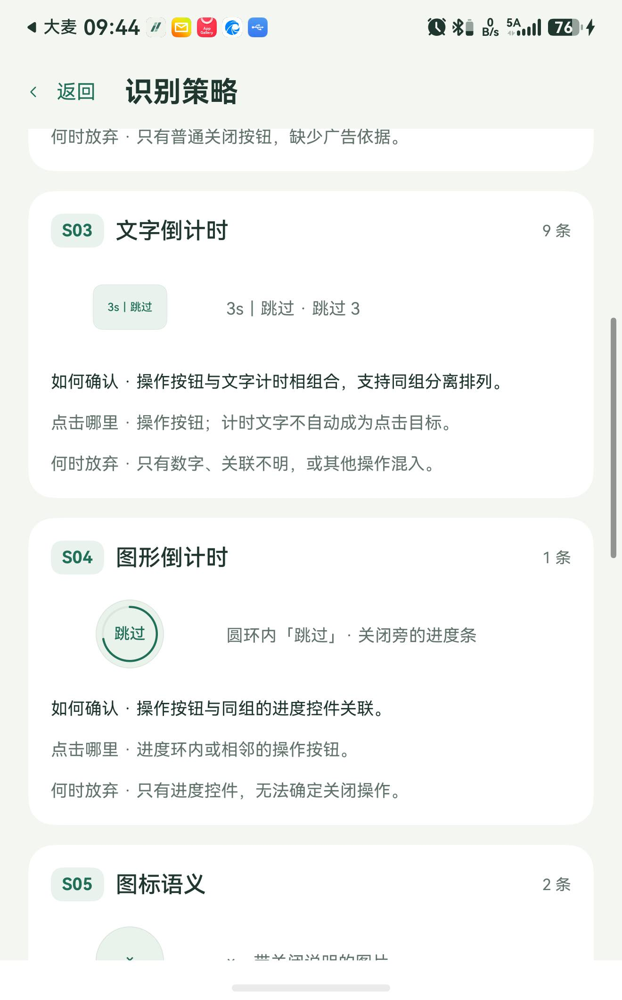

# 使用说明

先完成 [侧载安装](INSTALL.md)，再按下面的顺序开始使用。**只侧载轻启主包，UiTest 工作模块由轻启在首次本机连接时自动安装。**

截图来自 Pura X / HarmonyOS 7，通过官方 hdc 与系统截图工具采集。规则页为 **0.9.51**、强化学习为 **0.9.48**，新增设置为 **0.9.45**（2026-09-14），其余为 0.9.42（2026-09-13）。图中的应用、数量和端口是拍摄时的状态，以自己手机显示为准；点击图片可查看大图。

## 1. 连接本机，确认在线

首次使用按向导操作；以后从“概览 → 本机连接”进入。已在线时，可点击右上角“在线”，再展开“查看重新连接步骤”。

1. 按页面入口开启开发者模式；若系统要求重启，重启后回到轻启。
2. 开启无线调试，记下系统当前显示的端口。
3. 在轻启填写端口，点击“连接轻启”，并允许系统调试授权。
4. 等待自动准备工作模块、应用重新打开，确认概览显示“在线”。覆盖安装可能让应用重启，轻启会自动核验安装结果并继续连接；若失败会显示原因，可重新连接。

图中已经连接，因此按钮显示“已连接”；不要照抄示例端口。重启、端口改变或会话结束后，按上述步骤重新连接即可，无需删除规则或手动导入 UiTest。

“自动跳过”是总开关。暂时不想跳过时可关闭它；“会话详情”中可结束本次连接。激活成功后无需电脑持续连接。概览的“本次已跳过”从 0.9.46 起按本次会话实际发出的点击次数统计；是否确认消失仍在运行记录中单独展示。

## 2. 发现广告并启用规则

1. 在“设置”中保持“学习新规则”和“自动发现应用”开启。
2. 正常打开其他应用，触发一次开屏广告。
3. 返回“规则 → 待确认”，检查按钮文字、样式与广告位置，确认后启用。
4. 确认该应用及自动跳过总开关已开启，再次遇到匹配样式时查看跳过结果。

图中是“全部规则”下的**已启用规则**，所以按钮显示“停用此规则”。“待确认”计数只表示等待确认的新样式数量，不代表学习功能是否开启。

- 同一应用只占一个卡片；有多条规则时可左右滑动切换，通过圆点查看位置。
- 手机轮廓中的标记表示广告按钮位置，外侧文字显示识别到的按钮样式。
- 已有规则不会阻止学习新样式。默认新规则需确认；开启“设置 → 规则自动启用”后，新发现的自动规则直接启用，不会重新开启已停用的旧规则。
- 卡片顶部居中显示当前规则的策略编号和自动／手动来源，与左右滑动同步切换；点击标识可查看对应策略。搜索框可按应用、按钮文字或策略编号快速查找。
- 删除单条规则：左右滑到目标规则，点击启用／停用按钮右侧的圆形删除按钮并确认；其他规则保留。以后再次识别到该样式时仍可重新学习。
- **应用管理中的“删除规则并重新学习”会删除该应用原有规则及审批状态。** 仅临时关闭时用“停用此规则”。

## 3. 按应用管理检测

底部进入“应用”，上方滑块切换分区；搜索框只搜索当前分区，找不到时先切换分区。

| 分区 | 含义 |
| --- | --- |
| 自动跳过 | 已有启用规则，可自动跳过的应用 |
| 待观察 | 已发现、仍需观察和确认规则的应用 |
| 已暂停 | 手动暂停，或多次未见广告后自动暂停的应用 |

点击“管理”可查看该应用并调整检测状态。“待观察”卡片显示有效检查次数及还需满足的时间条件。带“卓”标记的应用来自卓易通；系统无法提供显示名时，可手动备注。

### 强化学习：手动示范一次关闭

遇到未识别的广告，无需删除原规则：

1. 确认轻启在线，在“应用”中找到目标应用，点击“管理 → 开始强化学习”。
2. 轻启自动打开该应用。系统若询问，请选择“打开”；随后等待广告出现，60 秒内该应用的自动点击暂停。
3. 手动点击广告的“跳过”或关闭按钮。轻启将点击事件与点击前的控件布局对应，并检查目标是否消失。
4. 点击后自动返回应用管理并弹窗显示结果。成功时追加一条**已启用的手动识别规则**，原规则保留；失败会说明事件未收到、控件无法对应、快照过期或消失未确认等原因。

离开目标应用、取消或超时会结束本次学习。系统未提供点击事件、无法对应唯一控件或未确认消失时，可重新尝试；并非所有自绘按钮都会产生可读取的控件点击事件。学习仅在主动开启的短时会话中进行，布局临时保存在内存，不留存完整页面或截图。

## 4. 用运行记录排查问题

进入“概览 → 运行记录”，每个运行过程占一张卡片。点击右侧**眼睛图标**展开时间线，查看具体原因和用时，再次点击可收起。

图中记录说明“此应用已暂停”，因此没有学习或点击。遇到相同情况，可去“应用 → 已暂停 → 管理”恢复检测。

| 信息 | 怎么看 |
| --- | --- |
| 确认消失 | 连续两次未再看到目标控件，不单独证明是点击导致广告关闭 |
| 尝试点击 | 已执行点击尝试，不等于广告一定关闭 |
| 未能确认 | 未取得足够的关闭证据，不等于必然失败 |
| `+… 秒` | 相对这次运行过程的时间；下面同时显示具体时刻 |
| 本轮检查用时 | 本次检查耗时，与“发现前台后经过多久”分别显示 |

## 5. 调整学习、暂停和通知

进入“设置”，上方是自动识别和跳过提醒。

**未见广告时自动暂停**：点击“调整暂停与复查”，可设置观察跨度、完整检查次数和复查间隔。默认是观察满 1 天、完成 3 次检查、每 7 天复查。

正常情况下稳定观察约 6 秒，信息不稳时最多 12 秒；有效检查之间需间隔 30 分钟。达到时间和次数门槛后，仍需有效检查确认，不会只因时间流逝自动暂停。自动暂停后可手动恢复，并不表示该应用永远没有广告。

**新规则通知**：学到新样式时提醒已启用或等待确认；点击通知进入规则页。可单独关闭，需要系统通知权限。

**跳过通知**：开启后累计更新同一条静音通知。可选择 1～60 秒后自动收起，或关闭“自动收起”后手动清除。收起时间控制通知中心里的通知，横幅展示由系统控制。用“预览通知”检查效果，“通知设置”可进入系统设置。

HarmonyOS 6.1 的完整布局识别通过手机自己的无线调试通道读取。运行期间请保持无线调试开启；系统更换端口后，在轻启重新连接。该通道仅连接 `127.0.0.1`，不需要电脑或外网。

## 6. 识别条件和主题

在设置页继续向下滑动。

“广告识别方式”提供 S01～S08 的图形示例、确认依据、点击位置与放弃条件。规则卡片显示对应编号，点击即可直达说明。按钮外形、文字顺序和进度控件随采集结果绘制；外形未提供时默认使用圆角矩形，旧规则无需删除。详见[广告识别方式](RECOGNITION.md)。

“按钮用词”是可选的本机文字条件编辑器，不需要订阅或云端更新。它影响新样式识别，不会更改已确认的应用规则；不确定时保留默认条件。

主题支持“白色”“黑色”和“跟随系统”。选择“跟随系统”后，应用随系统明暗模式切换。

## 常见问题

| 问题 | 先检查什么 |
| --- | --- |
| 连接失败 | 完整主包、无线调试、当前端口及系统授权；详细排错见 [侧载指南](INSTALL.md#遇到问题) |
| 升级后离线 | 在轻启中重新本机连接，不必删除规则 |
| 在线但不点击 | 规则是否启用、应用是否暂停、总开关是否开启，再看时间线原因 |
| 没有学到规则 | 学习和自动发现是否开启；缺少控件信息或广告依据时会拒绝学习 |
| 应用只显示包名 | 系统或卓易通可能未提供名称，可手动备注 |
| 通知没有横幅 | 检查系统通知权限及横幅设置，先使用“预览通知”测试 |

## 连接恢复与退出诊断

本机连接成功后默认开启自动跳过，并配置有上限的自动恢复。临时暂停点击请关闭“自动跳过”；需要彻底结束工作和恢复任务，请在概览展开“会话详情”，点击“结束本次连接”。明确的 User Request（用户终止请求）和“结束本次连接”会停止恢复，其他退出均可尝试恢复。连续失败按 5、15、30、60 秒最多重试四次，仍不成功则停止并提示重新连接；稳定在线 1 分钟后重置连续失败计数。手机重启或监督进程本身被结束后仍需重新连接。

正常后台检测不会打开轻启。异常恢复时为读取系统退出原因，可能短暂出现启动画面，随后返回后台。

遇到后台被杀，重新打开轻启，在“设置 → 运行诊断”查看系统退出记录；可点“复制完整记录”反馈。系统未提供原因时会如实显示，不把心跳停止直接判作系统杀进程。后台恢复仍受系统限制。HarmonyOS 6.1 已完成一次真实低内存回收与自动恢复验证，不能保证所有后台场景均可恢复。完整记录包含系统退出原因、监督恢复时间线，以及最近 20 次工作模块异常的消息、堆栈和发生阶段；自动重启不会清除这些异常。
